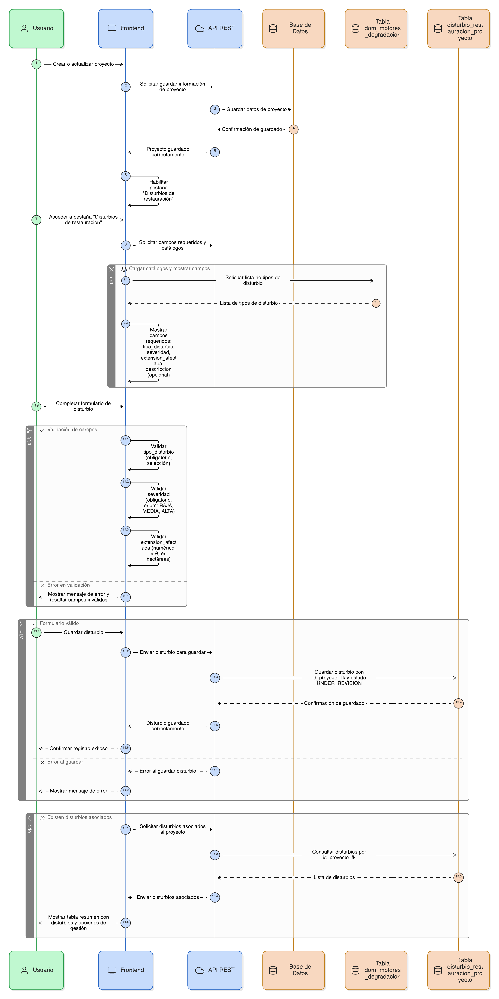
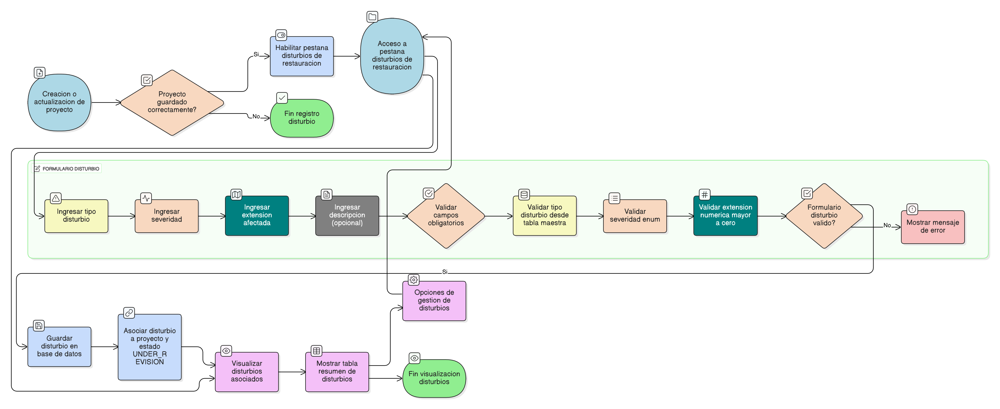

## HU-IDEAM-SNIF-REST-111

> **Identificador Historia de Usuario:** hu-ideam-snif-rest-111 \
> **Nombre Historia de Usuario:** Módulo de restauración - Disturbios o Motores de Degradación.

> **Área Proyecto:** Subdirección de Ecosistemas e Información Ambiental \
> **Nombre proyecto:** Realizar la construcción temática, mejoras informáticas y optimización del Módulo de restauración del SNIF del IDEAM. \
> **Líder funcional:** Wilmer Espitia Muñoz\
> **Analista de requerimiento de TI:** Sergio Alonso Anaya Estévez

## DESCRIPCIÓN HISTORIA DE USUARIO

> **Como:** usuario del sistema. \
> **Quiero:** documentar las causas o disturbios que generaron la necesidad de restauración.   \
> **Para:** tener un registro claro del diagnóstico ambiental inicial.

## CRITERIOS DE ACEPTACIÓN

1. **Disturbios o Motores de Degradación**  
1.1 Dado que el usuario ha creado o actualizado un proyecto, cuando el sistema guarda correctamente la información del proyecto, entonces la pestaña **“Disturbios de restauración”** debe habilitarse automáticamente dentro del formulario. \
1.2 Dado que el usuario accede a la pestaña “Disturbios de restauración”, cuando crea o edita un registro, entonces el sistema debe mostrar los siguientes **campos requeridos**: `tipo_disturbio`, `severidad`, `extension_afectada`, y `descripcion` (opcional). \
1.3 Dado que el usuario selecciona el campo **tipo_disturbio**, cuando completa el formulario, entonces el sistema debe exigir que sea un **campo obligatorio** de tipo selección, cargado desde la tabla maestra **`dom_motores_degradacion`**. \
1.4 Dado que el usuario selecciona el campo **severidad**, cuando llena el formulario, entonces el sistema debe exigir una opción obligatoria de tipo **enum**, con los valores posibles: `BAJA`, `MEDIA` o `ALTA`. \
1.5 Dado que el usuario completa el campo **extension_afectada**, cuando intenta guardar el registro, entonces el sistema debe validar que el valor sea **numérico** y **mayor que 0 ( > 0 )**, expresado en **hectáreas**. \
1.6 Dado que el usuario guarda un registro válido de disturbio, cuando el sistema almacena la información, entonces debe **guardar los datos en la tabla `disturbio_restauracion_proyecto`**, asociando correctamente el registro al **`id_proyecto_fk`** correspondiente, y asignando por defecto el estado **`UNDER_REVISION`**. \
1.7 Dado que existen registros de disturbios asociados a un proyecto, cuando el usuario visualiza la pestaña “Disturbios de restauración”, entonces el sistema debe mostrar los registros almacenados en una **tabla resumen**, con las columnas principales de información y opciones de gestión. \

## DIAGRAMA DE SECUENCIA

## DIAGRAMA DE FLUJO DEL PROCESO

## PROTOTIPO PRELIMINAR

## ANEXOS

-	[HU-IDEAM-SNIF-REST-101](/content/historias_usuario/HU-IDEAM-SNIF-REST-101/HU-IDEAM-SNIF-REST-101.md)
-  Mapeo de errores de validación a mensajes específicos.