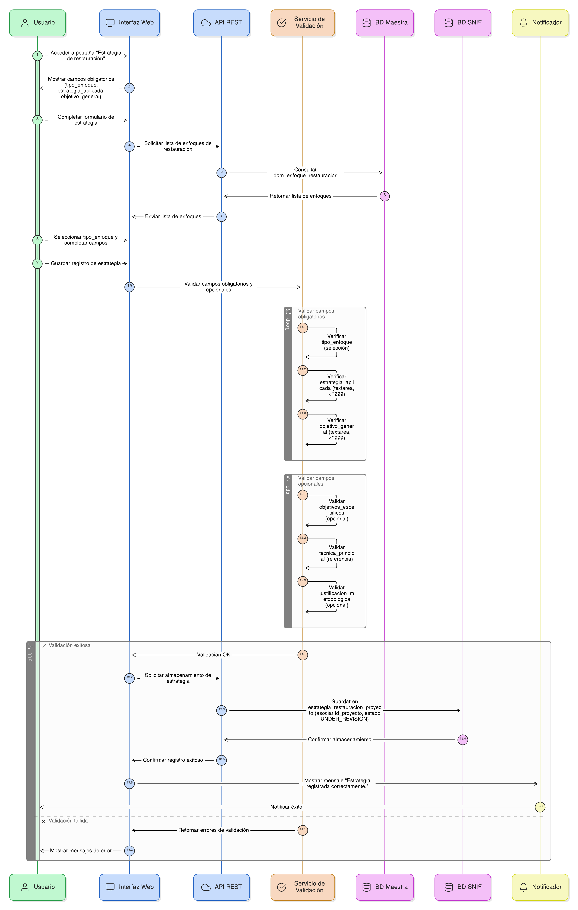
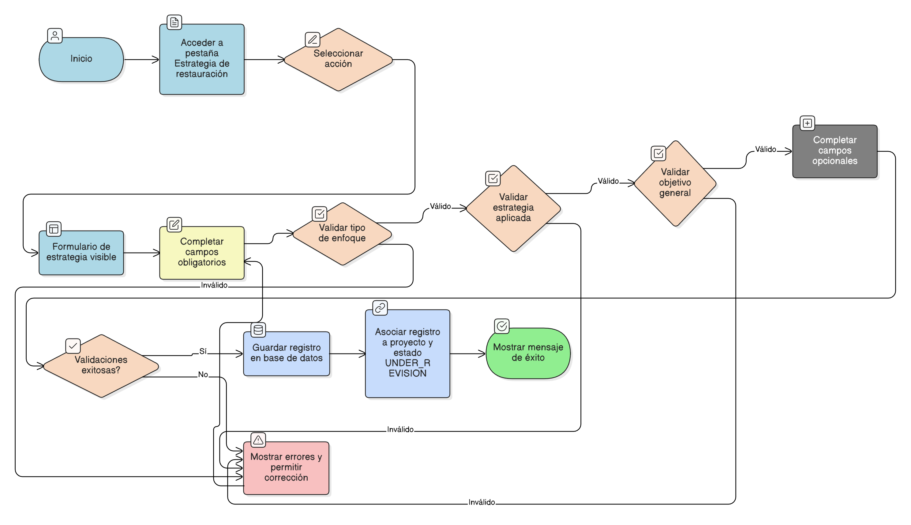

## HU-IDEAM-SNIF-REST-112

> **Identificador Historia de Usuario:** hu-ideam-snif-rest-112 \
> **Nombre Historia de Usuario:** Módulo de restauración - Definición del Enfoque / Estrategia de Restauración.

> **Área Proyecto:** Subdirección de Ecosistemas e Información Ambiental \
> **Nombre proyecto:** Realizar la construcción temática, mejoras informáticas y optimización del Módulo de restauración del SNIF del IDEAM. \
> **Líder funcional:** Wilmer Espitia Muñoz\
> **Analista de requerimiento de TI:** Sergio Alonso Anaya Estévez

## DESCRIPCIÓN HISTORIA DE USUARIO

> **Como:** usuario del sistema. \
> **Quiero:** definir el enfoque técnico y conceptual de la restauración aplicada.   \
> **Para:** documentar la justificación metodológica y los objetivos del proyecto.

## CRITERIOS DE ACEPTACIÓN

1. **Enfoque / Estrategia de Restauración**  
1.1 Dado que el usuario accede a la pestaña **“Estrategia de restauración”**, cuando crea o edita un registro, entonces el sistema debe mostrar los siguientes **campos obligatorios**: `tipo_enfoque`, `estrategia_aplicada` y `objetivo_general`. \
1.2 Dado que el usuario selecciona el campo **tipo_enfoque**, cuando completa el formulario, entonces el sistema debe exigir que sea un **campo obligatorio** de tipo selección, cargado desde la tabla maestra **`dom_enfoque_restauracion`**. \
1.3 Dado que el usuario completa el campo **estrategia_aplicada**, cuando guarda el registro, entonces el sistema debe validar que sea un **campo tipo textarea obligatorio**, con una longitud máxima de **1000 caracteres**. \
1.4 Dado que el usuario completa el campo **objetivo_general**, cuando guarda el registro, entonces el sistema debe validar que sea un **campo tipo textarea obligatorio**, con una longitud máxima de **1000 caracteres**. \
1.5 Dado que el usuario desea complementar la información, cuando llena los campos opcionales, entonces el sistema debe permitir registrar los siguientes campos adicionales: `objetivos_especificos` (textarea opcional);  `tecnica_principal` (referencia a **`dom_tecnica_restauracion`**); `justificacion_metodologica` (texto opcional). \
1.6 Dado que el usuario guarda un registro válido de estrategia, cuando el sistema almacena la información, entonces debe **guardar los datos en la tabla `estrategia_restauracion_proyecto`**, asociando correctamente el registro al **`id_proyecto`** y asignando por defecto el estado **`UNDER_REVISION`**. \
1.7 Dado que el registro se guarda exitosamente, cuando la transacción finaliza, entonces el sistema debe mostrar el mensaje: **“Estrategia registrada correctamente.”** \

## DIAGRAMA DE SECUENCIA

## DIAGRAMA DE FLUJO DEL PROCESO

## PROTOTIPO PRELIMINAR

## ANEXOS

-	[HU-IDEAM-SNIF-REST-101](/content/historias_usuario/HU-IDEAM-SNIF-REST-101/HU-IDEAM-SNIF-REST-101.md)
-  Mapeo de errores de validación a mensajes específicos.