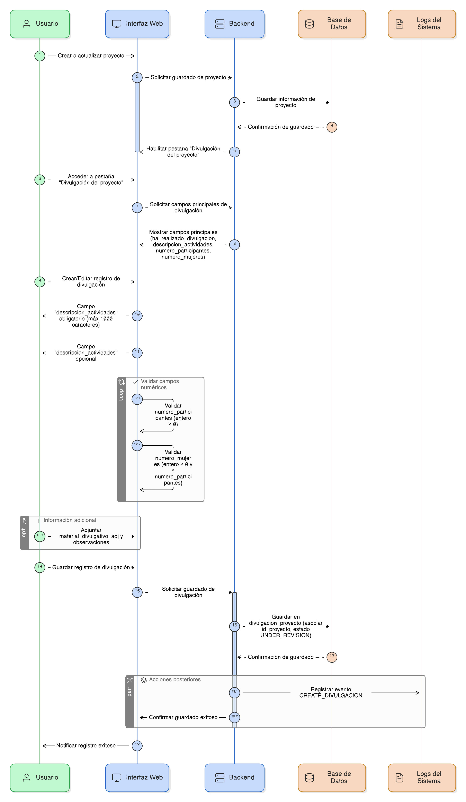
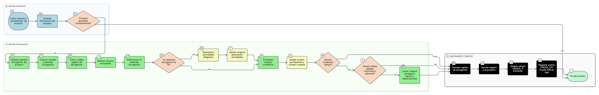

## HU-IDEAM-SNIF-REST-113

> **Identificador Historia de Usuario:** hu-ideam-snif-rest-113 \
> **Nombre Historia de Usuario:** Módulo de restauración - Procesos de Divulgación y Participación Comunitaria.

> **Área Proyecto:** Subdirección de Ecosistemas e Información Ambiental \
> **Nombre proyecto:** Realizar la construcción temática, mejoras informáticas y optimización del Módulo de restauración del SNIF del IDEAM. \
> **Líder funcional:** Wilmer Espitia Muñoz\
> **Analista de requerimiento de TI:** Sergio Alonso Anaya Estévez

## DESCRIPCIÓN HISTORIA DE USUARIO

> **Como:** usuario del sistema. \
> **Quiero:** registrar las actividades de divulgación, sensibilización o capacitación realizadas con la comunidad.   \
> **Para:** documentar el componente social y participativo del proyecto.

## CRITERIOS DE ACEPTACIÓN

1. **Gestión de divulgación del proyecto**

1.1 Dado que el usuario ha creado o actualizado un proyecto, cuando el sistema guarda correctamente la información del proyecto, entonces la pestaña **“Divulgación del proyecto”** debe habilitarse automáticamente dentro del formulario. \

1.2 Dado que el usuario accede a la pestaña “Divulgación del proyecto”, cuando crea o edita un registro, entonces el sistema debe mostrar los siguientes **campos principales**:  
- `ha_realizado_divulgacion` (lista Sí/No),  
- `descripcion_actividades`,  
- `numero_participantes`,  
- `numero_mujeres`. \

1.3 Dado que el usuario selecciona el campo **ha_realizado_divulgacion**, cuando su valor es **“Sí”**, entonces el campo **descripcion_actividades** debe volverse **obligatorio** y permitir un texto con un máximo de **1000 caracteres**. \

1.4 Dado que el usuario completa los campos numéricos, cuando intenta guardar el registro, entonces el sistema debe validar las siguientes **reglas numéricas**:  
- `numero_participantes`: valor **entero ≥ 0**,  
- `numero_mujeres`: valor **entero ≥ 0** y **≤ numero_participantes**. \

1.5 Dado que el usuario desea agregar información adicional, cuando llena los campos opcionales, entonces el sistema debe permitir los siguientes campos:  
- `material_divulgativo_adj` (boolean o adjunto relacionado),  
- `observaciones` (texto opcional). \

1.6 Dado que el usuario guarda un registro válido de divulgación, cuando el sistema almacena la información, entonces debe **guardar los datos en la tabla `divulgacion_proyecto`**, asociando correctamente el registro al **`id_proyecto`**, asignando por defecto el estado **`UNDER_REVISION`** y registrando un evento en los **logs del sistema** con la acción **`CREAR_DIVULGACION`**. \

## DIAGRAMA DE SECUENCIA

## DIAGRAMA DE FLUJO DEL PROCESO

## PROTOTIPO PRELIMINAR

## ANEXOS

-	[HU-IDEAM-SNIF-REST-101](/content/historias_usuario/HU-IDEAM-SNIF-REST-101/HU-IDEAM-SNIF-REST-101.md)
-  Mapeo de errores de validación a mensajes específicos.