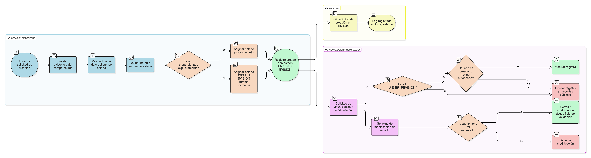

## HU-IDEAM-SNIF-REST-128

> **Identificador Historia de Usuario:** hu-ideam-snif-rest-128 \
> **Nombre Historia de Usuario:** Estándar de Sistema - Asignación de Estado Inicial (UNDER_REVISION) .

> **Área Proyecto:** Subdirección de Ecosistemas e Información Ambiental \
> **Nombre proyecto:** Realizar la construcción temática, mejoras informáticas y optimización del Módulo de restauración del SNIF del IDEAM. \
> **Líder funcional:** Wilmer Espitia Muñoz\
> **Analista de requerimiento de TI:** Sergio Alonso Anaya Estévez

## DESCRIPCIÓN HISTORIA DE USUARIO

> **Como:** : sistema.     \
> **Quiero:** asignar el estado *'UNDER_REVISION'* a todo nuevo registro creado en tablas operativas o temáticas.      \
> **Para:** garantizar que toda la información generada en el sistema pase obligatoriamente por un proceso de revisión o validación técnica, previo a su aprobación o publicación definitiva.

## CRITERIOS DE ACEPTACIÓN

1. **Asignación y Tipificación del Estado**     
        1.1.	**Estado Predeterminado (RN1/CA1)**: Todo registro insertado en una tabla operativa o temática (ej. proyecto, area\_restaurada, indicador\_monitoreo, etc.) debe asumir automáticamente el valor *'UNDER_REVISION'* en su campo estado al momento de la creación.         
        1.2.	**Integridad del Campo (RN3/CA2)**: El campo estado debe existir en todas las tablas temáticas con un tipo de dato VARCHAR(50) o ENUM, y no se permite valor NULO en ninguna inserción.         
        1.3.	**Validación Backend (RN4/CA3)**: La API o capa de servicio (backend) debe validar la existencia del valor de estado. Si el valor de estado no es proporcionado explícitamente durante la inserción, el sistema lo asigna automáticamente a *'UNDER_REVISION'*.
2. **Control de Flujo y Auditoría**     
        2.1.	**Control de Flujo (RN2/CA5)**: El campo estado solo podrá ser modificado posteriormente por usuarios con rol autorizado (ej. Supervisor o Administrador), desde un flujo de validación específico.     
        2.2.	**Registro de Auditoría (RN5/CA4)**: Toda creación de registro con estado *'UNDER_REVISION'* deberá generar un registro en la tabla *logs\_sistema* con la acción *“CREACIÓN DE REGISTRO EN REVISIÓN”*. El log debe incluir: usuario, tabla afectada, ID del registro, fecha, acción y el estado asignado.      
        2.3.	*Visualización Restringida (RN6)*: Los registros con estado *'UNDER_REVISION'* no se deben mostrar en reportes, listados o consultas públicas. Solo se visualizarán para usuarios con permisos de revisión o el usuario creador del registro.

    

## DIAGRAMA DE SECUENCIA

## DIAGRAMA DE FLUJO DEL PROCESO

## PROTOTIPO PRELIMINAR

## ANEXOSs

- Lista de tablas operativas afectadas por esta regla (incluyendo las mencionadas en el requerimiento).
- Definición del tipo de dato y la restricción *NOT NULL* para el campo *estado*.

