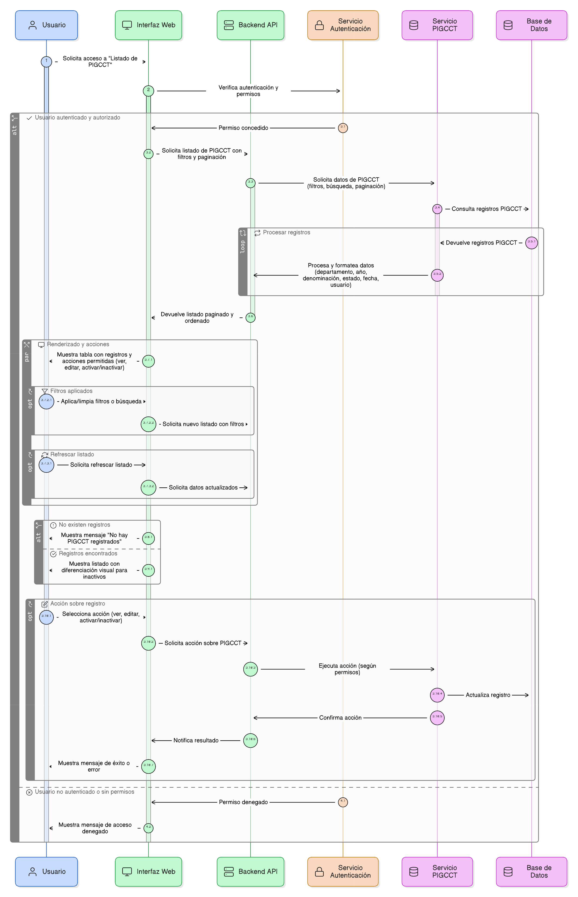
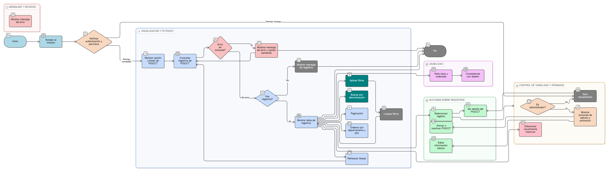

# HU-PIGCCT-SYM-003  
## Épica: Administración de la tabla maestra de PIGCCT  
### Consultar listado de PIGCCT

---

## DESCRIPCIÓN HISTORIA DE USUARIO

> **Como:** usuario del sistema.  
> **Quiero:** consultar y visualizar el listado de todos los PIGCCT registrados en el sistema.  
> **Para:** conocer los planes existentes por departamento, año y estado, y facilitar su consulta, análisis y gestión según mi rol y permisos.

---

## CRITERIOS DE ACEPTACIÓN

### 1. Acceso al listado de PIGCCT
1.1 El sistema debe permitir el acceso al listado de PIGCCT a los usuarios autenticados, de acuerdo con su rol y permisos.  
1.2 La opción **“Listado de PIGCCT”** debe estar disponible desde el módulo de **Administración** o **Gestión del PIGCCT**.  
1.3 Al acceder, el sistema debe mostrar una vista tipo tabla con los registros existentes.

### 2. Información mínima del listado
2.1 Cada registro del listado debe mostrar como mínimo los siguientes campos:
- Departamento.
- Año del PIGCCT.
- Denominación del plan.
- Estado (Activo / Inactivo).
- Fecha de creación.
- Usuario creador (según permisos).

2.2 La información debe presentarse ordenada por defecto por **departamento** y **año** (descendente).

### 3. Filtros y búsqueda
3.1 El sistema debe permitir filtrar el listado por:
- Departamento.
- Año.
- Estado del PIGCCT.

3.2 El sistema debe permitir realizar búsquedas por texto sobre la denominación del plan.  
3.3 Los filtros deben poder combinarse entre sí.

### 4. Paginación y rendimiento
4.1 El listado debe contar con paginación configurable (por ejemplo: 10, 25, 50 registros por página).  
4.2 El sistema debe optimizar la consulta para garantizar tiempos de respuesta adecuados aun con grandes volúmenes de información.

### 5. Acciones sobre el listado
5.1 Según el rol del usuario, el sistema debe permitir acciones sobre cada PIGCCT:
- Ver detalle del PIGCCT.
- Editar información básica (solo para roles autorizados).
- Activar / Inactivar el PIGCCT (solo administradores).

5.2 Las acciones deben presentarse de forma clara mediante botones o menús contextuales.

### 6. Control de visibilidad por estado y rol
6.1 Los PIGCCT en estado **Inactivo** deben mostrarse en el listado con una diferenciación visual.  
6.2 Los usuarios sin permisos de administración solo deben poder visualizar la información, sin opciones de edición.

### 7. Mensajes y estados del sistema
7.1 Si no existen registros, el sistema debe mostrar un mensaje indicando que no hay PIGCCT registrados.  
7.2 En caso de error en la consulta, el sistema debe informar al usuario y permitir reintentar la operación.

### 8. Usabilidad y experiencia de usuario
8.1 La vista del listado debe ser clara, ordenada y consistente con el diseño general del sistema.  
8.2 El sistema debe permitir refrescar el listado para visualizar cambios recientes.  
8.3 Los filtros aplicados deben poder limpiarse fácilmente.

---

### Resultado esperado

El usuario puede **consultar de forma clara y eficiente el listado de PIGCCT registrados**, identificar los planes existentes por departamento y año, y acceder a las acciones permitidas según su rol, fortaleciendo la gestión y control de la información del PIGCCT.

---

## DIAGRAMA DE SECUENCIA

## DIAGRAMA DE FLUJO DEL PROCESO

## PROTOTIPO PRELIMINAR

