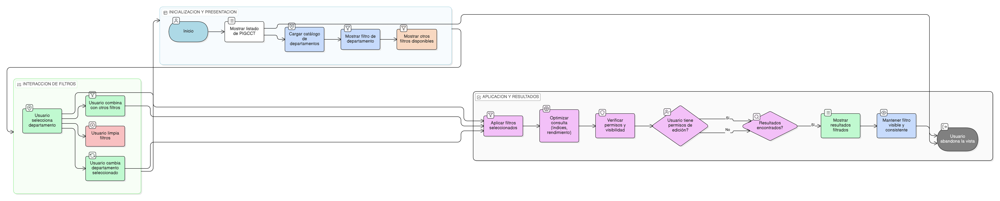

# HU-PIGCCT-SYM-004  
## Épica: Administración de la tabla maestra de PIGCCT  
### Filtrar PIGCCT por departamento

---

## DESCRIPCIÓN HISTORIA DE USUARIO

> **Como:** usuario del sistema.  
> **Quiero:** filtrar el listado de PIGCCT por departamento.  
> **Para:** consultar de manera rápida y focalizada la información territorial asociada a un departamento específico.

## CRITERIOS DE ACEPTACIÓN

### 1. Disponibilidad del filtro por departamento
1.1 El sistema debe incluir un filtro de **Departamento** en la vista de listado de PIGCCT.  
1.2 El filtro debe presentarse como un campo seleccionable (lista desplegable o buscador) alimentado desde el catálogo oficial de departamentos de Colombia.  

### 2. Aplicación del filtro
2.1 Al seleccionar un departamento, el sistema debe actualizar el listado de PIGCCT mostrando únicamente los registros correspondientes al departamento seleccionado.  
2.2 El filtrado debe ejecutarse de forma inmediata o al confirmar la acción, sin recargar completamente la página.

### 3. Combinación con otros filtros
3.1 El filtro por departamento debe poder combinarse con otros filtros disponibles, tales como:
- Año del PIGCCT.
- Estado (Activo / Inactivo).
- Búsqueda por denominación.

### 4. Comportamiento del filtro
4.1 El sistema debe permitir limpiar el filtro de departamento y retornar al listado completo de PIGCCT.  
4.2 Si no existen PIGCCT para el departamento seleccionado, el sistema debe mostrar un mensaje indicando que no hay resultados.

### 5. Rendimiento y optimización
5.1 El sistema debe optimizar la consulta para garantizar tiempos de respuesta adecuados, haciendo uso de índices sobre el campo de departamento.  
5.2 El filtrado debe soportar escenarios con un alto número de registros sin afectar la experiencia del usuario.

### 6. Control de visibilidad y permisos
6.1 El filtrado debe respetar las reglas de visibilidad definidas por rol y permisos del usuario.  
6.2 Los usuarios sin permisos de edición solo podrán visualizar los resultados filtrados.

### 7. Usabilidad y experiencia de usuario
7.1 El filtro debe ser claro, intuitivo y consistente con el diseño general del sistema.  
7.2 El departamento seleccionado debe permanecer visible mientras el filtro esté activo.  
7.3 El sistema debe permitir cambiar el departamento seleccionado sin necesidad de limpiar manualmente el filtro.

### Resultado esperado

El usuario puede **filtrar eficientemente los PIGCCT por departamento**, accediendo de manera ágil a la información territorial relevante y mejorando la consulta y análisis de los planes de gestión del cambio climático.

## DIAGRAMA DE SECUENCIA

## DIAGRAMA DE FLUJO DEL PROCESO

## PROTOTIPO PRELIMINAR

