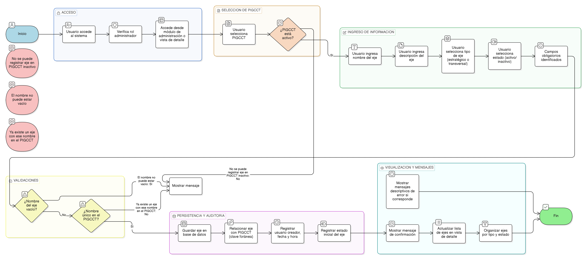

# HU-PIGCCT-SYM-012  
## Épica: Administración de ejes del PIGCCT  
### Registrar eje del PIGCCT

---

## DESCRIPCIÓN HISTORIA DE USUARIO

> **Como:** usuario administrador.  
> **Quiero:** crear un eje asociado a un PIGCCT.  
> **Para:** estructurar los componentes estratégicos y transversales del plan de gestión de cambio climático.

---

## CRITERIOS DE ACEPTACIÓN

### 1. Acceso a la funcionalidad
1.1 El sistema debe permitir únicamente a usuarios con rol **administrador** registrar ejes del PIGCCT.  
1.2 La funcionalidad debe estar disponible desde:
- El módulo de administración del PIGCCT.
- La vista de detalle de un PIGCCT activo.

### 2. Asociación obligatoria al PIGCCT
2.1 Para registrar un eje, el sistema debe exigir la selección de un **PIGCCT activo**.  
2.2 No debe permitirse la creación de ejes asociados a PIGCCT inactivos.

### 3. Información requerida del eje
3.1 El sistema debe solicitar como mínimo la siguiente información:
- Nombre del eje.
- Descripción del eje.
- Tipo de eje (estratégico / transversal).
- Estado (activo/inactivo).

3.2 Los campos obligatorios deben estar claramente identificados.

### 4. Validaciones del registro
4.1 El sistema debe validar que el nombre del eje no esté vacío.  
4.2 El sistema debe validar la **unicidad del eje dentro del mismo PIGCCT** (no deben existir dos ejes con el mismo nombre asociados al mismo plan).  
4.3 El sistema debe impedir el registro de ejes duplicados por error del usuario.

### 5. Persistencia e integridad de la información
5.1 Al guardar el eje, el sistema debe almacenar la información en la base de datos manteniendo integridad referencial con el PIGCCT.  
5.2 La base de datos debe implementar una relación (clave foránea) entre ejes y PIGCCT.

### 6. Visualización de ejes
6.1 El sistema debe mostrar los ejes asociados a un PIGCCT en su vista de detalle.  
6.2 Los ejes deben visualizarse organizados por:
- Tipo de eje.
- Estado.

### 7. Auditoría y trazabilidad
7.1 El sistema debe registrar:
- Usuario creador del eje.
- Fecha y hora de creación.
- Estado inicial del eje.

### 8. Usabilidad y experiencia de usuario
8.1 El sistema debe mostrar mensajes claros de confirmación al registrar el eje.  
8.2 En caso de error o validación fallida, el sistema debe mostrar mensajes descriptivos que indiquen la causa.

---

### Resultado esperado

El administrador puede **registrar ejes asociados a un PIGCCT activo**, garantizando estructura estratégica del plan, integridad referencial, unicidad y trazabilidad de la información.

---

## DIAGRAMA DE SECUENCIA

## DIAGRAMA DE FLUJO DEL PROCESO

