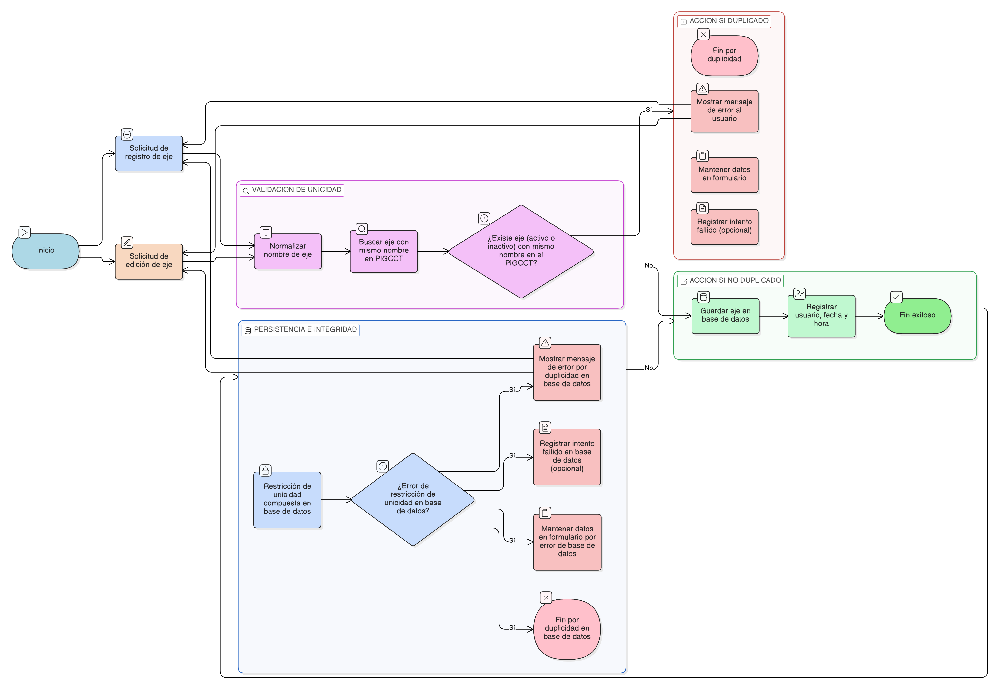

# HU-PIGCCT-SYM-014  
## Épica: Administración de ejes del PIGCCT  
### Validar unicidad del eje por PIGCCT

---

## DESCRIPCIÓN HISTORIA DE USUARIO

> **Como:** usuario administrador.  
> **Quiero:** que el sistema valide la unicidad del nombre de los ejes dentro de un mismo PIGCCT.  
> **Para:** evitar duplicidades, mantener claridad conceptual y garantizar coherencia en la estructura del plan.

## CRITERIOS DE ACEPTACIÓN

### 1. Regla de unicidad
1.1 El sistema debe impedir la creación de dos o más ejes con el **mismo nombre** asociados al **mismo PIGCCT**.  
1.2 La validación debe considerar:
- Comparación insensible a mayúsculas y minúsculas.
- Eliminación de espacios en blanco al inicio y al final.

### 2. Validación al registrar un eje
2.1 Al intentar registrar un eje, el sistema debe validar previamente si existe un eje con el mismo nombre asociado al PIGCCT seleccionado.  
2.2 Si la validación falla:
- El sistema no debe permitir guardar el registro.
- Debe mostrarse un mensaje claro indicando que el eje ya existe para ese PIGCCT.

### 3. Validación al editar un eje
3.1 Al modificar el nombre de un eje, el sistema debe volver a ejecutar la validación de unicidad.  
3.2 No debe permitirse cambiar el nombre por uno que ya exista dentro del mismo PIGCCT.

### 4. Alcance de la unicidad
4.1 La unicidad debe aplicarse **por PIGCCT**, no de forma global.  
4.2 El mismo nombre de eje puede existir en distintos PIGCCT sin generar conflicto.

### 5. Persistencia e integridad en base de datos
5.1 La base de datos debe implementar una **restricción de unicidad compuesta** sobre:
- Identificador del PIGCCT.
- Nombre del eje normalizado.

5.2 Esta restricción debe actuar como mecanismo de respaldo ante errores de validación en la capa de aplicación.

### 6. Comportamiento con ejes inactivos
6.1 Un eje inactivo no debe permitir la creación de otro eje con el mismo nombre dentro del mismo PIGCCT.  
6.2 El sistema debe considerar tanto ejes activos como inactivos para la validación de unicidad.

### 7. Auditoría y control
7.1 El sistema debe registrar:
- Intentos fallidos de creación por duplicidad (opcional).
- Usuario que realizó el registro o edición.
- Fecha y hora del evento.

### 8. Usabilidad y experiencia de usuario
8.1 El mensaje de error debe ser claro y orientado al usuario, por ejemplo:  
> “Ya existe un eje con este nombre para el PIGCCT seleccionado.”

8.2 El sistema no debe perder la información ya ingresada en el formulario tras un error de validación.

### Resultado esperado

El sistema **garantiza que no existan ejes duplicados dentro de un mismo PIGCCT**, asegurando claridad, coherencia estructural e integridad de la información del plan.

   
## DIAGRAMA DE SECUENCIA

## DIAGRAMA DE FLUJO DEL PROCESO

## PROTOTIPO PRELIMINAR

