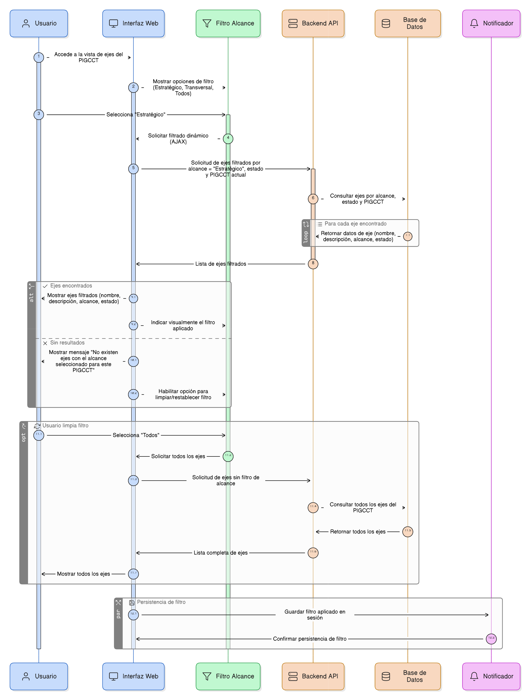

# HU-PIGCCT-SYM-016  
## Épica: Administración de ejes del PIGCCT  
### Filtrar ejes por alcance

---

## DESCRIPCIÓN HISTORIA DE USUARIO

> **Como:** usuario del sistema (consulta o administrador).  
> **Quiero:** filtrar los ejes de un PIGCCT por su alcance (estratégico o transversal).  
> **Para:** analizar de manera focalizada los componentes específicos del plan territorial de gestión del cambio climático.

---

## CRITERIOS DE ACEPTACIÓN

### 1. Disponibilidad del filtro
1.1 El sistema debe disponer de una opción de filtro por **alcance del eje** en la vista de consulta de ejes del PIGCCT.  
1.2 El filtro debe estar disponible para todos los usuarios con permisos de consulta.

### 2. Tipos de alcance
2.1 El filtro debe permitir seleccionar al menos las siguientes opciones:
- Estratégico.
- Transversal.
- Todos (valor por defecto).

2.2 El sistema debe utilizar la clasificación definida en el registro del eje.

### 3. Aplicación del filtro
3.1 Al seleccionar un tipo de alcance, el sistema debe mostrar únicamente los ejes que correspondan a la opción seleccionada.  
3.2 El filtrado debe realizarse sin recargar completamente la página (cuando la arquitectura lo permita).  
3.3 El filtro debe poder combinarse con otros criterios existentes, como:
- Estado del eje (activo/inactivo).
- PIGCCT seleccionado.

### 4. Visualización de resultados
4.1 Los ejes filtrados deben mostrarse manteniendo el formato estándar de la vista:
- Nombre.
- Descripción.
- Alcance.
- Estado.

4.2 El sistema debe indicar visualmente el filtro aplicado.

### 5. Manejo de resultados vacíos
5.1 Si no existen ejes que coincidan con el alcance seleccionado, el sistema debe mostrar un mensaje informativo, por ejemplo:
> “No existen ejes con el alcance seleccionado para este PIGCCT”.

5.2 El sistema debe permitir limpiar o restablecer el filtro fácilmente.

### 6. Usabilidad y experiencia de usuario
6.1 El filtro debe ser claro, intuitivo y accesible desde la vista principal de ejes.  
6.2 El sistema debe recordar el filtro aplicado mientras el usuario permanezca en la vista del PIGCCT seleccionado.

---

### Resultado esperado

El usuario puede **filtrar y analizar los ejes de un PIGCCT según su alcance estratégico o transversal**, facilitando la comprensión y evaluación de los componentes del plan de forma segmentada y eficiente.

---

## DIAGRAMA DE SECUENCIA

## DIAGRAMA DE FLUJO DEL PROCESO

## PROTOTIPO PRELIMINAR

