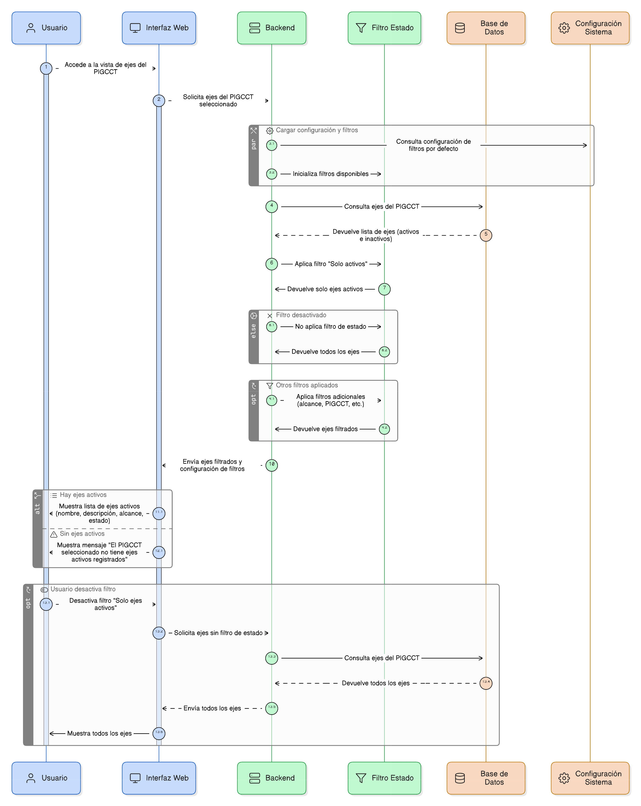

# HU-PIGCCT-SYM-017  
## Épica: Administración de ejes del PIGCCT  
### Visualizar solo ejes activos

---

## DESCRIPCIÓN HISTORIA DE USUARIO

> **Como:** usuario del sistema (consulta o administrador).  
> **Quiero:** visualizar únicamente los ejes activos de un PIGCCT.  
> **Para:** trabajar exclusivamente con información vigente en el análisis y seguimiento del plan territorial de gestión del cambio climático.

---

## CRITERIOS DE ACEPTACIÓN

### 1. Disponibilidad del filtro de estado
1.1 El sistema debe disponer de una opción para **filtrar por estado del eje** en la vista de ejes del PIGCCT.  
1.2 El filtro debe estar disponible para usuarios con permisos de consulta y administración.

### 2. Comportamiento del filtro
2.1 Al activar la opción **“Solo ejes activos”**, el sistema debe mostrar únicamente los ejes cuyo estado sea **activo**.  
2.2 Por defecto, el sistema puede mostrar:
- Todos los ejes (activos e inactivos), o  
- Solo ejes activos, según la configuración definida por el administrador.

### 3. Integración con otros filtros
3.1 El filtro de ejes activos debe poder combinarse con otros filtros existentes, tales como:
- Alcance del eje (estratégico / transversal).
- PIGCCT seleccionado.

3.2 El sistema debe aplicar los filtros de manera acumulativa y coherente.

### 4. Visualización de resultados
4.1 Los ejes activos deben visualizarse con el formato estándar definido para la vista:
- Nombre del eje.
- Descripción.
- Alcance.
- Estado.

4.2 El sistema no debe mostrar información de ejes inactivos cuando el filtro esté activo.

### 5. Manejo de resultados sin coincidencias
5.1 Si el PIGCCT no cuenta con ejes activos, el sistema debe mostrar un mensaje informativo, por ejemplo:
> “El PIGCCT seleccionado no tiene ejes activos registrados”.

5.2 El sistema debe permitir desactivar fácilmente el filtro para visualizar todos los ejes.

### 6. Usabilidad y experiencia de usuario
6.1 El control de filtro debe ser claro e intuitivo (checkbox, switch o selector).  
6.2 El sistema debe indicar de forma visible cuando el filtro **“Solo ejes activos”** se encuentre aplicado.

---

### Resultado esperado

El usuario puede **visualizar y trabajar únicamente con los ejes activos de un PIGCCT**, garantizando que los análisis, consultas y procesos se realicen sobre información vigente y relevante.

---

## DIAGRAMA DE SECUENCIA

## DIAGRAMA DE FLUJO DEL PROCESO

## PROTOTIPO PRELIMINAR

