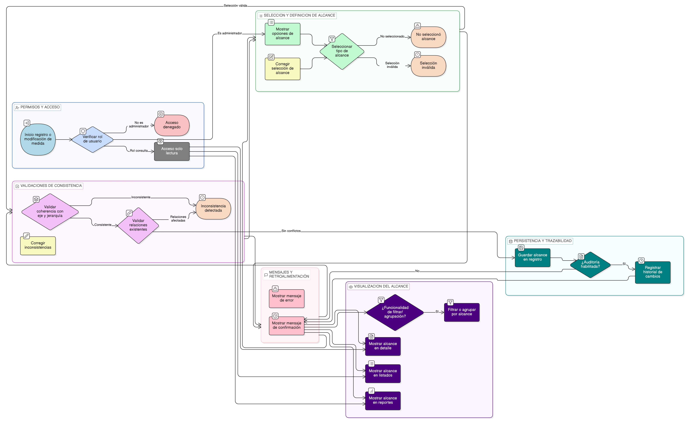

# HU-PIGCCT-SYM-025  
## Épica: Administración de medidas del PIGCCT  
### Definir alcance de la medida

---

## DESCRIPCIÓN HISTORIA DE USUARIO

> **Como:** usuario administrador.  
> **Quiero:** clasificar una medida del PIGCCT según su alcance.  
> **Para:** diferenciar claramente entre **Línea estratégica**, **Línea de acción** o **Medida**, facilitando la estructuración, jerarquización y análisis del plan.

## CRITERIOS DE ACEPTACIÓN

### 1. Permisos y acceso
1.1 El sistema debe permitir definir y modificar el alcance de la medida **únicamente** a usuarios con rol de **administrador**.  
1.2 Los usuarios con rol de consulta deben visualizar el alcance solo en modo lectura.

### 2. Tipos de alcance disponibles
2.1 El sistema debe permitir seleccionar uno de los siguientes tipos de alcance:
- Línea estratégica.
- Línea de acción.
- Medida.

2.2 Estos valores deben provenir de un catálogo controlado del sistema.

### 3. Definición del alcance en el registro
3.1 El sistema debe exigir la definición del alcance al momento de registrar una medida.  
3.2 El alcance debe ser un campo obligatorio.

### 4. Validaciones de consistencia
4.1 El sistema debe validar que el alcance seleccionado sea coherente con:
- El eje asociado.
- La estructura jerárquica definida para el PIGCCT.

4.2 En caso de cambio de alcance:
- El sistema debe verificar que no se afecten relaciones existentes con otros componentes.

### 5. Persistencia y trazabilidad
5.1 El sistema debe almacenar el alcance seleccionado como parte del registro de la medida.  
5.2 El sistema debe conservar el historial de cambios de alcance si cuenta con auditoría.

### 6. Visualización del alcance
6.1 El alcance de la medida debe ser visible en:
- Listados de medidas.
- Vista de detalle de la medida.
- Reportes y módulos que consuman la información.

6.2 El sistema debe permitir filtrar o agrupar medidas por su alcance (si existe funcionalidad relacionada).

### 7. Mensajes y retroalimentación
7.1 El sistema debe mostrar mensajes claros en caso de:
- No selección del alcance.
- Selección inválida.

7.2 Al guardar correctamente, el sistema debe confirmar la operación.

### Resultado esperado

El usuario administrador puede **definir y gestionar el alcance de cada medida del PIGCCT**, asegurando una correcta clasificación entre líneas estratégicas, líneas de acción y medidas, y fortaleciendo la claridad estructural del plan.

   
## DIAGRAMA DE SECUENCIA

## DIAGRAMA DE FLUJO DEL PROCESO

## PROTOTIPO PRELIMINAR

